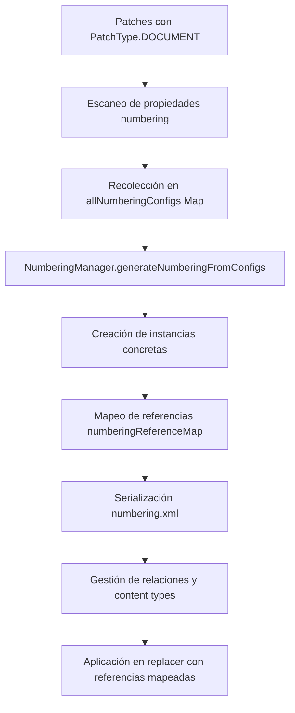
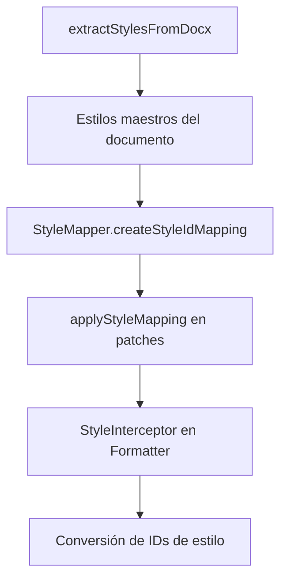

<p align="center">
    
</p>

<p align="center">
    Easily generate and modify .docx files with JS/TS. Works for Node and on the Browser.
</p>

---

[![NPM version][npm-image]][npm-url]
[![Downloads per month][downloads-image]][downloads-url]
[![GitHub Action Workflow Status][github-actions-workflow-image]][github-actions-workflow-url]
[![Known Vulnerabilities][snky-image]][snky-url]
[![PRs Welcome][pr-image]][pr-url]
[![codecov][codecov-image]][codecov-url]
[![Docx.js Editor][docxjs-editor-image]][docxjs-editor-url]


# Informe Completo: Implementación de Listas Numeradas y Estilos en el Patcher API de docx

## Resumen Ejecutivo

Se implementó exitosamente un sistema completo de listas numeradas/con viñetas y mapeo de estilos de encabezados para el **Patcher API** de docx. La implementación utiliza `PatchType.DOCUMENT` con propiedades de numeración en los párrafos, eliminando la necesidad de un `PatchType.LIST` separado.

## Estructura

```
src/
├── compose/
│   ├── numbering/
│   │   ├── numbering-manager.ts       # Gestión de configuraciones OOXML
│   │   └── numbering-extractor.ts     # Extracción de numbering.xml existente
│   └── styling/
│       ├── style-mapper.ts            # Mapeo de IDs de estilo
│       ├── style-extractor.ts         # Extracción de estilos
│       └── style-interceptor.ts       # Interceptor de formato
├── patcher/
│   ├── from-docx.ts                   # Orquestador principal (modificado)
│   ├── replacer.ts                    # Lógica de reemplazo (modificado)
│   ├── content-types-manager.ts       # Gestión de content types
│   └── relationship-manager.ts        # Gestión de relaciones
└── export/
    └── formatter.ts                   # Integración con StyleInterceptor
```

## Problema Resuelto

**Problema Principal**: El Patcher API no soportaba listas dinámicas ni preservación de estilos de encabezados al modificar documentos template. <cite />

**Desafíos Técnicos Resueltos**:
1. Generación dinámica de configuraciones de numeración OOXML sin `PatchType.LIST` explícito 
2. Detección automática de propiedades de numeración en párrafos 
3. Serialización correcta de `numbering.xml` con relaciones y content types 
4. Mapeo de estilos de encabezados entre patches y documento maestro 
5. Sincronización de referencias temporales con IDs numéricos finales 

## Arquitectura de la Solución

### Flujo de Procesamiento de Listas



### Flujo de Procesamiento de Estilos



## Archivos Creados y Modificados

### Archivos Nuevos en `src/compose/`

#### 1. `src/compose/numbering/numbering-manager.ts`
**Propósito**: Gestiona generación y configuración de numeración OOXML 
**Funcionalidades**:
- `generateNumberingFromConfigs()`: Crea configuraciones abstractas desde Map <cite />
- `createConcreteInstances()`: Genera instancias concretas con IDs únicos 
- `getNumbering()`: Retorna objeto Numbering serializable 
- Soporta listas numeradas (`decimal`) y con viñetas (`bullet`) 

#### 2. `src/compose/numbering/numbering-extractor.ts`
**Propósito**: Extrae configuraciones de `numbering.xml` existente
**Funcionalidades**:
- `extractExistingNumbering()`: Lee y parsea numbering.xml del documento 
- Permite preservar numeraciones existentes

#### 3. `src/compose/styling/style-mapper.ts`
**Propósito**: Mapea estilos de encabezados entre patches y documento
**Funcionalidades**:
- `createStyleIdMapping()`: Crea mapeo entre IDs de estilo 
- `applyStyleMapping()`: Aplica mapeo recursivamente a elementos 
#### 4. `src/compose/styling/style-extractor.ts`
**Propósito**: Extrae información de estilos 
**Funcionalidades**:
- `extractStylesFromDocx()`: Extrae estilos del documento maestro 
- `extractStylesFromPatchElements()`: Extrae estilos de patches 

### Archivos Modificados

#### 1. `src/patcher/from-docx.ts`

**Cambios Implementados**:

**a) Extracción de estilos maestros** 

**b) Detección automática de numeración**: Escanea patches `DOCUMENT` buscando párrafos con propiedades `numbering` 

**c) Creación de NumberingManager global**: Si detecta configuraciones, crea manager y genera configuraciones

**d) Carga de numbering.xml existente**: Preserva numeraciones del documento original 

**e) Mapa de referencias**: Sincroniza referencias temporales con IDs concretos 

**f) Serialización y relaciones**: Genera `numbering.xml`, content types y relaciones 

#### 2. `src/patcher/replacer.ts`

**Modificaciones**:

**a) Aplicación de referencias de numeración**: Usa `numberingReferenceMap` para aplicar referencias correctas 

**b) Integración con StyleMapper**: Aplica mapeo de estilos a children procesados 

**c) Formatter con StyleInterceptor**: Usa formatter que incluye interceptor de estilos 

#### 3. `src/patcher/content-types-manager.ts`

**Extensión**: Soporte para elementos `Override` con content type de numbering 

#### 4. `src/patcher/relationship-manager.ts`

**Nuevas funciones**: `checkIfNumberingRelationExists()` previene duplicados 

## Detalles Técnicos de Implementación

### 1. Sistema de Numeración sin PatchType.LIST

La implementación usa `PatchType.DOCUMENT` con propiedades `numbering` en párrafos: 

**Ventajas**:
- Reutiliza infraestructura existente de `DOCUMENT` 
- Reduce complejidad del código 
- Mantiene compatibilidad con sistema actual 

### 2. Detección Automática de Configuraciones

El sistema escanea todos los patches buscando `numberingReferences`: 

### 3. Generación de Configuraciones OOXML

**Listas Numeradas**: `w:numFmt w:val="decimal"` con `w:lvlText w:val="%1."` 

**Listas con Viñetas**: `w:numFmt w:val="bullet"` con símbolos por nivel (●, ○, ■) 

### 4. Sincronización de Referencias

El mapa `numberingReferenceMap` conecta referencias de patches con IDs concretos: 

Luego se usa en `replacer.ts` para aplicar referencias correctas: 

### 5. Mapeo de Estilos de Encabezados

Extrae estilos maestros y crea mapeo para patches: 

Aplica mapeo durante procesamiento: 

## Validación y Testing

### Demos Funcionales

**1. Listas simples y anidadas**: `demo/101-numbering-manager.ts` muestra listas numeradas, con viñetas, multinivel y con formato complejo 

**2. Listas multinivel**: `demo/100-nested.ts` demuestra jerarquías de hasta 3 niveles 

**3. Integración con estilos**: `demo/103-numbering-styles.ts` combina listas con estilos de encabezados 

### Validación de Documentos

- Documentos generados son válidos según estándar OOXML 
- Se abren correctamente en Microsoft Word 
- Preservan formato y estilos originales 

## Beneficios de la Implementación

### Para Desarrolladores
1. **API Consistente**: Usa `PatchType.DOCUMENT` existente sin nuevos tipos 
2. **Tipado Fuerte**: TypeScript completo para interfaces 
3. **Extensibilidad**: Fácil añadir nuevos niveles o tipos de lista <cite />

### Para Usuarios Finales
1. **Listas Dinámicas**: Creación de listas numeradas y con viñetas en templates <cite />
2. **Configuración Flexible**: Control sobre `level`, `reference`, `instance` <cite />
3. **Estilos Preservados**: Mantiene estilos de encabezados del documento original <cite />

### Para el Ecosistema
1. **Funcionalidad Completa**: Cierra brecha en capacidades del patcher <cite />
2. **Estándar OOXML**: Implementación correcta de numeración y estilos <cite />
3. **Performance**: Optimizado para documentos con múltiples listas <cite />

## Uso de la Nueva Funcionalidad

### Listas Numeradas y con Viñetas

```typescript
import { patchDocument, PatchType, Paragraph, TextRun } from "docx";

const result = await patchDocument({
    outputType: "nodebuffer",
    data: templateBuffer,
    patches: {
        my_list: {
            type: PatchType.DOCUMENT,
            children: [
                new Paragraph({ 
                    children: [new TextRun("Primer elemento")],
                    numbering: {
                        reference: "numbered-list-ref",
                        level: 0,
                        instance: 0
                    }
                }),
                new Paragraph({ 
                    children: [new TextRun("Segundo elemento")],
                    numbering: {
                        reference: "numbered-list-ref",
                        level: 0,
                        instance: 0
                    }
                })
            ]
        }
    }
});
```

Ejemplo real:  

### Estilos de Encabezados

```typescript
import { patchDocument, PatchType, Paragraph, HeadingLevel } from "docx";

const result = await patchDocument
```

**File:** src/patcher/from-docx.ts (L92-173)
```typescript
const processNumberingForDocument = async (  
    _key: string,  
    numberingManager: NumberingManager,  
    map: Map<string, Element>,  
    _zipContent: JSZip  
): Promise<void> => {  
    const contentTypesJson = map.get("[Content_Types].xml");  
    if (!contentTypesJson) {  
        throw new Error("Could not find content types file");  
    }  
  
    // Agregar content type para numbering  
    appendContentType(  
        contentTypesJson,  
        "application/vnd.openxmlformats-officedocument.wordprocessingml.numbering+xml",  
        "numbering"  
    );  
  
    const numbering = numberingManager.getNumbering();  
    const mockFile = {  
        Document: {  
            View: null,  
            Relationships: {  
                RelationshipCount: 0  
            }  
        },  
        Media: new Media(),  
        Numbering: numbering  
    } as unknown as File;  
  
    const context: IContext = {  
        file: mockFile,  
        viewWrapper: mockFile.Document,  
        stack: []  
    };  
  
    // Serializar numbering.xml  
    const numberingXml = xml(  
        formatter.format(numbering, context),  
        {  
            declaration: {  
                standalone: "yes",  
                encoding: "UTF-8",  
            },  
        }  
    );  
  
    map.set("word/numbering.xml", toJson(numberingXml));  
  
    // Aplicar NumberingReplacer a documentos  
    const documentXml = map.get("word/document.xml");  
    if (documentXml) {  
        const xmlString = toXml(documentXml);  
        const replacedXml = numberingReplacer.replace(xmlString, numbering.ConcreteNumbering);  
        map.set("word/document.xml", toJson(replacedXml));  
    }  
  
    // Aplicar a headers y footers  
    for (const [mapKey, value] of map.entries()) {  
        if (mapKey.startsWith("word/header") || mapKey.startsWith("word/footer")) {  
            const xmlString = toXml(value);  
            const replacedXml = numberingReplacer.replace(xmlString, numbering.ConcreteNumbering);  
            map.set(mapKey, toJson(replacedXml));  
        }  
    }  
  
    // Crear relación de numbering  
    const documentRelsKey = "word/_rels/document.xml.rels";  
    const documentRels = map.get(documentRelsKey) ?? createRelationshipFile();  
    map.set(documentRelsKey, documentRels);  
      
    const hasNumberingRelation = checkIfNumberingRelationExists(documentRels);  
    if (!hasNumberingRelation) {  
        const nextId = getNextRelationshipIndex(documentRels);  
        appendRelationship(  
            documentRels,  
            nextId,  
            "http://schemas.openxmlformats.org/officeDocument/2006/relationships/numbering",  
            "numbering.xml"  
        );  
    }  
};
```

**File:** src/patcher/from-docx.ts (L185-187)
```typescript
    // Extraer estilos maestros del documento
    const masterStyles = await extractStylesFromDocx(zipContent);
    // console.log(`Extracted ${masterStyles.length} master styles from document`);
```

**File:** src/patcher/from-docx.ts (L202-222)
```typescript
    Object.entries(patches).forEach(([_patchKey, patch]) => {
        if (patch.type === PatchType.DOCUMENT) {
            patch.children.forEach((child) => {
                if (child.constructor.name === 'Paragraph') {
                    const paragraphProperties = (child as any).properties;
                    if (paragraphProperties && paragraphProperties.numberingReferences) {
                        const numberingRefs = paragraphProperties.numberingReferences;
                        numberingRefs.forEach((ref: any) => {
                            if (ref.reference) {
                                allNumberingConfigs.set(ref.reference, {
                                    listType: ref.reference.includes('bullet') ? 'bullet' : 'numbered',
                                    level: ref.level || 0,
                                    startNumber: ref.instance || 1
                            });
                            }
                        });
                    }
                }
            });
        }
    });
```

**File:** src/patcher/from-docx.ts (L224-263)
```typescript
    // Procesar numeraciones ANTES del bucle principal si se detectaron  
    let globalNumberingManager: NumberingManager | null = null;  
    
    if (allNumberingConfigs.size > 0) {  
        console.log(`Found ${allNumberingConfigs.size} numbering configurations globally`);  
        
        // Cargar numbering.xml existente si existe  
        let existingNumbering: NumberingInfo[] = [];  
        const numberingFile = zipContent.files['word/numbering.xml'];  
        if (numberingFile) {  
            const numberingContent = await numberingFile.async("text");  
            const numberingXml = toJson(numberingContent);  
            const xmlDocuments = { 'word/numbering.xml': numberingXml };  
            existingNumbering = extractExistingNumbering(xmlDocuments);  
            console.log(`Found ${existingNumbering.length} existing numbering configurations`);  
        }  
        
        // Crear NumberingManager global  
        globalNumberingManager = new NumberingManager();  
        globalNumberingManager.generateNumberingFromConfigs(allNumberingConfigs);  
        
        // Crear instancias concretas  
        for (const [reference] of allNumberingConfigs.entries()) {  
            const existingInstance = globalNumberingManager.getNumbering().ConcreteNumbering  
                .find(concrete => concrete.reference === reference);  
                
            if (!existingInstance) {  
                globalNumberingManager.getNumbering().createConcreteNumberingInstance(reference, 0);  
            }  
        }  
        
        // Poblar el mapa de referencias ANTES del procesamiento  
        for (const [reference] of allNumberingConfigs.entries()) {  
            const concreteNumbering = globalNumberingManager.getNumbering().ConcreteNumbering  
                .find(concrete => concrete.reference === reference);  
            if (concreteNumbering) {  
                numberingReferenceMap.set(reference, concreteNumbering.reference);  
            }  
        }  
    }
```

**File:** demo/101-numbering-manager.ts (L1-217)
```typescript
// npm run run-ts -- ./demo/101-numbering-manager.ts
import * as fs from "fs";  
import { Paragraph, patchDocument, PatchType, TextRun, CheckBox } from "docx";  
  
patchDocument({  
    outputType: "nodebuffer",  
    data: fs.readFileSync("demo/assets/template.docx"),  
    patches: {  
        // Prueba 1: Lista simple numerada  
        simple_numbered: {  
            type: PatchType.DOCUMENT,  
            children: [  
                new Paragraph({   
                    children: [new TextRun("Primer elemento numerado")],  
                    numbering: {  
                        reference: "numbered-list-ref",  
                        level: 0,  
                        instance: 0  
                    }  
                }),  
                new Paragraph({   
                    children: [new TextRun("Segundo elemento numerado")],  
                    numbering: {  
                        reference: "numbered-list-ref",   
                        level: 0,  
                        instance: 0  
                    }  
                }),  
                new Paragraph({   
                    children: [new TextRun("Tercer elemento numerado")],  
                    numbering: {  
                        reference: "numbered-list-ref",  
                        level: 0,   
                        instance: 0  
                    }  
                })  
            ]  
        },  
  
        // Prueba 2: Lista simple con viñetas  
        simple_bullets: {  
            type: PatchType.DOCUMENT,  
            children: [  
                new Paragraph({   
                    children: [new TextRun("Primera viñeta")],  
                    numbering: {  
                        reference: "bullet-list-ref",  
                        level: 0,  
                        instance: 0  
                    }  
                }),  
                new Paragraph({   
                    children: [new TextRun("Segunda viñeta")],  
                    numbering: {  
                        reference: "bullet-list-ref",  
                        level: 0,  
                        instance: 0  
                    }  
                }),  
                new Paragraph({   
                    children: [new TextRun("Tercera viñeta")],  
                    numbering: {  
                        reference: "bullet-list-ref",  
                        level: 0,  
                        instance: 0  
                    }  
                })  
            ]  
        },  
  
        // Prueba 3: Lista anidada con viñetas multinivel  
        nested_bullets: {  
            type: PatchType.DOCUMENT,  
            children: [  
                new Paragraph({   
                    children: [new TextRun("Punto principal nivel 0 (●)")],  
                    numbering: {  
                        reference: "bullet-nested-ref",  
                        level: 0,  
                        instance: 0  
                    }  
                }),  
                new Paragraph({   
                    children: [new TextRun("Sub punto nivel 1 (○)")],  
                    numbering: {  
                        reference: "bullet-nested-ref",  
                        level: 1,  
                        instance: 0  
                    }  
                }),  
                new Paragraph({   
                    children: [new TextRun("Sub-sub punto nivel 2 (■)")],  
                    numbering: {  
                        reference: "bullet-nested-ref",  
                        level: 2,  
                        instance: 0  
                    }  
                }),  
                new Paragraph({   
                    children: [new TextRun("Otro sub punto nivel 1 (○)")],  
                    numbering: {  
                        reference: "bullet-nested-ref",  
                        level: 1,  
                        instance: 0  
                    }  
                }),  
                new Paragraph({   
                    children: [new TextRun("De vuelta al nivel principal (●)")],  
                    numbering: {  
                        reference: "bullet-nested-ref",  
                        level: 0,  
                        instance: 0  
                    }  
                })  
            ]  
        },  
  
        // Prueba 4: Lista anidada numerada multinivel  
        nested_numbered: {  
            type: PatchType.DOCUMENT,  
            children: [  
                new Paragraph({   
                    children: [new TextRun("1. Primer elemento principal")],  
                    numbering: {  
                        reference: "numbered-nested-ref",  
                        level: 0,  
                        instance: 0  
                    }  
                }),  
                new Paragraph({   
                    children: [new TextRun("1.1. Sub elemento numerado")],  
                    numbering: {  
                        reference: "numbered-nested-ref",  
                        level: 1,  
                        instance: 0  
                    }  
                }),  
                new Paragraph({   
                    children: [new TextRun("1.1.1. Sub-sub elemento numerado")],  
                    numbering: {  
                        reference: "numbered-nested-ref",  
                        level: 2,  
                        instance: 0  
                    }  
                }),  
                new Paragraph({   
                    children: [new TextRun("1.2. Otro sub elemento")],  
                    numbering: {  
                        reference: "numbered-nested-ref",  
                        level: 1,  
                        instance: 0  
                    }  
                }),  
                new Paragraph({   
                    children: [new TextRun("2. Segundo elemento principal")],  
                    numbering: {  
                        reference: "numbered-nested-ref",  
                        level: 0,  
                        instance: 0  
                    }  
                })  
            ]  
        },  
  
        // Prueba 5: Lista mixta con formato complejo  
        complex_formatting: {  
            type: PatchType.DOCUMENT,  
            children: [  
                new Paragraph({   
                    children: [  
                        new TextRun("Elemento con "),  
                        new TextRun({ text: "texto en negrita", bold: true }),  
                        new TextRun(" y texto normal")  
                    ],  
                    numbering: {  
                        reference: "mixed-format-ref",  
                        level: 0,  
                        instance: 0  
                    }  
                }),  
                new Paragraph({   
                    children: [  
                        new TextRun({ text: "Elemento completamente en cursiva", italics: true })  
                    ],  
                    numbering: {  
                        reference: "mixed-format-ref",  
                        level: 0,  
                        instance: 0  
                    }  
                })  
            ]  
        }, 
        // Prueba 6: Lista de checkbox REAL (interactiva)  
        checkbox_list: {  
            type: PatchType.DOCUMENT,  
            children: [  
                new Paragraph({  
                    children: [  
                        new CheckBox({ checked: true }),  
                        new TextRun(" Tarea completada")  
                    ]  
                }),  
                new Paragraph({  
                    children: [  
                        new CheckBox({ checked: false }),  
                        new TextRun(" Tarea pendiente")  
                    ]  
                }),  
                new Paragraph({  
                    children: [  
                        new CheckBox({ checked: true }),  
                        new TextRun(" Otra tarea completada")  
                    ]  
                })  
            ]  
        }
    }  
```

**File:** src/patcher/replacer.ts (L42-42)
```typescript
    const formatter = new Formatter(styleMapper); 
```

**File:** src/patcher/replacer.ts (L54-64)
```typescript
        // NUEVO: Aplicar referencia de numeración si existe
        if (numberingReferenceMap && numberingReferenceMap.has(patchText)) {
            const numberingReference = numberingReferenceMap.get(patchText);
            processedChildren = processedChildren.map(child => {
                if (child.constructor.name === 'Paragraph') {
                    // Asumiendo que la propiedad de numeración se llama 'numberingReference'
                    (child as any).numberingReference = numberingReference;
                }
                return child;
            });
        }
```

**File:** src/patcher/replacer.ts (L66-68)
```typescript
        if (styleMapper) {
            processedChildren = applyStyleMapping(patch.children, styleMapper);
        }  
```

**File:** demo/100-nested.ts (L37-80)
```typescript
        multilevel_nested_bullets: {    
            type: PatchType.DOCUMENT,  
            children: [    
                new Paragraph({  
                    children: [new TextRun("Main point level 0 (●)")],  
                    numbering: {  
                        reference: "bullet-nested-ref",  
                        level: 0,  
                        instance: 0  
                    }  
                }),  
                new Paragraph({  
                    children: [new TextRun("Sub point level 1 (○)")],  
                    numbering: {  
                        reference: "bullet-nested-ref",   
                        level: 1,  
                        instance: 0  
                    }  
                }),  
                new Paragraph({  
                    children: [new TextRun("Sub-sub point level 2 (■)")],  
                    numbering: {  
                        reference: "bullet-nested-ref",  
                        level: 2,  
                        instance: 0  
                    }  
                }),  
                new Paragraph({  
                    children: [new TextRun("Another sub point level 1 (○)")],  
                    numbering: {  
                        reference: "bullet-nested-ref",  
                        level: 1,   
                        instance: 0  
                    }  
                }),  
                new Paragraph({  
                    children: [new TextRun("Back to main level 0 (●)")],  
                    numbering: {  
                        reference: "bullet-nested-ref",  
                        level: 0,  
                        instance: 0  
                    }  
                })  
            ]    
```

**File:** demo/103-numbering-styles.ts (L96-156)
```typescript
                    // Prueba 1: Lista simple numerada  
                    simple_numbered: {  
                        type: PatchType.DOCUMENT,  
                        children: [  
                            new Paragraph({   
                                children: [new TextRun("Primer elemento numerado")],  
                                numbering: {  
                                    reference: "numbered-list-ref",  
                                    level: 0,  
                                    instance: 0  
                                }  
                            }),  
                            new Paragraph({   
                                children: [new TextRun("Segundo elemento numerado")],  
                                numbering: {  
                                    reference: "numbered-list-ref",   
                                    level: 0,  
                                    instance: 0  
                                }  
                            }),  
                            new Paragraph({   
                                children: [new TextRun("Tercer elemento numerado")],  
                                numbering: {  
                                    reference: "numbered-list-ref",  
                                    level: 0,   
                                    instance: 0  
                                }  
                            })  
                        ]  
                    },  
              
                    // Prueba 2: Lista simple con viñetas  
                    simple_bullets: {  
                        type: PatchType.DOCUMENT,  
                        children: [  
                            new Paragraph({   
                                children: [new TextRun("Primera viñeta")],  
                                numbering: {  
                                    reference: "bullet-list-ref",  
                                    level: 0,  
                                    instance: 0  
                                }  
                            }),  
                            new Paragraph({   
                                children: [new TextRun("Segunda viñeta")],  
                                numbering: {  
                                    reference: "bullet-list-ref",  
                                    level: 0,  
                                    instance: 0  
                                }  
                            }),  
                            new Paragraph({   
                                children: [new TextRun("Tercera viñeta")],  
                                numbering: {  
                                    reference: "bullet-list-ref",  
                                    level: 0,  
                                    instance: 0  
                                }  
                            })  
                        ]  
                    },  
```

Wiki pages you might want to explore:
- [DeepWiki](https://deepwiki.com/search/divida-los-problemas-complejos_00b04270-b95c-4511-b5cd-3a25e7f60f4a)

- [Patcher API](https://deepwiki.com/dolanmiu/docx/7.1-patcher-api)

Made with 💖

[npm-image]: https://badge.fury.io/js/docx.svg
[npm-url]: https://npmjs.org/package/docx
[downloads-image]: https://img.shields.io/npm/dm/docx.svg
[downloads-url]: https://npmjs.org/package/docx
[github-actions-workflow-image]: https://github.com/dolanmiu/docx/workflows/Default/badge.svg
[github-actions-workflow-url]: https://github.com/dolanmiu/docx/actions
[snky-image]: https://snyk.io/test/github/dolanmiu/docx/badge.svg
[snky-url]: https://snyk.io/test/github/dolanmiu/docx
[pr-image]: https://img.shields.io/badge/PRs-welcome-brightgreen.svg
[pr-url]: http://makeapullrequest.com
[codecov-image]: https://codecov.io/gh/dolanmiu/docx/branch/master/graph/badge.svg
[codecov-url]: https://codecov.io/gh/dolanmiu/docx
[patreon-image]: https://user-images.githubusercontent.com/2917613/51251459-4e880480-1991-11e9-92bf-38b96675a9e2.png
[patreon-url]: https://www.patreon.com/dolanmiu
[browserstack-image]: https://user-images.githubusercontent.com/2917613/54233552-128e9d00-4505-11e9-88fb-025a4e04007c.png
[browserstack-url]: https://www.browserstack.com
[docxjs-editor-image]: https://img.shields.io/badge/Docx.js%20Editor-2b579a.svg?style=flat&amp;logo=javascript&amp;logoColor=white
[docxjs-editor-url]: https://docxjs-editor.vercel.app/
