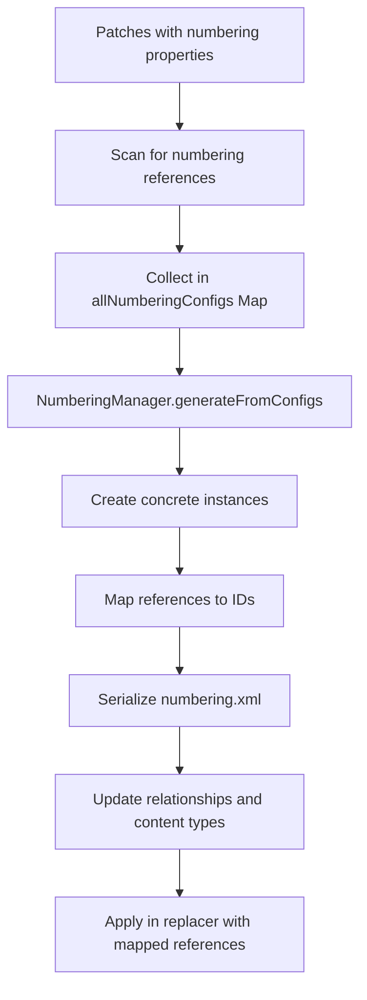
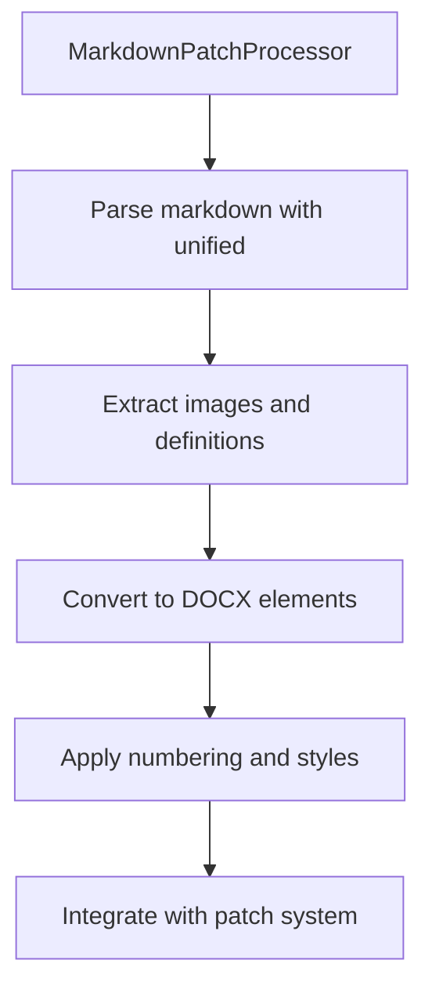

<p align="center">
    
</p>

<p align="center">
    Easily generate and modify .docx files with JS/TS. Works for Node and on the Browser.
</p>

---

[![NPM version][npm-image]][npm-url]
[![Downloads per month][downloads-image]][downloads-url]
[![GitHub Action Workflow Status][github-actions-workflow-image]][github-actions-workflow-url]
[![Known Vulnerabilities][snky-image]][snky-url]
[![PRs Welcome][pr-image]][pr-url]
[![codecov][codecov-image]][codecov-url]
[![Docx.js Editor][docxjs-editor-image]][docxjs-editor-url]


# Patcher API: Document Modification Enhanced

## Overview

The Patcher API now supports comprehensive document modification with **dynamic lists**, **style preservation**, and **Markdown-based content injection**. This enhanced system allows you to modify existing .docx templates using declarative JavaScript/TypeScript or intuitive Markdown syntax.

## Key Features

### 📝 **Markdown Patches**
Write content in Markdown format and automatically convert it to DOCX elements 
- Text formatting (**bold**, *italic*, strikethrough)
- Headings **(H1-H6)**
- Lists (*ordered*, *unordered*, *nested*)
- Task lists with **checkboxes**
- Tables with alignment
- Images with automatic resolution and references
- Links and hyperlinks

### 🔢 **Advanced Numbering System**
Complete support for lists 
- Numbered lists (decimal format)
- Bullet lists (●, ○, ■ symbols)
- Multi-level nesting (up to 9 levels)
- Automatic OOXML generation
- Style preservation

### 🎨 **Style Mapping & Preservation**
Automatic style extraction and mapping from master documents 
- Heading level preservation (1-6)
- Style ID mapping
- Format consistency
- Template style inheritance

## Architecture

```
src/
├── compose/
│   ├── numbering/
│   │   ├── numbering-manager.ts       # OOXML numbering configuration
│   │   └── numbering-extractor.ts     # Existing numbering extraction
│   └── styling/
│       ├── style-mapper.ts            # Style ID mapping
│       ├── style-extractor.ts         # Style extraction
│       └── style-interceptor.ts       # Format interception
├── patcher/
│   ├── from-docx.ts                   # Main orchestrator
│   ├── replacer.ts                    # Replacement logic
│   ├── markdown-converter.ts          # Markdown to DOCX conversion
│   ├── markdown-patch-processor.ts    # Markdown patch processing
│   ├── content-types-manager.ts       # Content types management
│   └── relationship-manager.ts        # Relationship management
└── export/
    └── formatter.ts                   # StyleInterceptor integration
```

## Usage Examples

### Markdown Patches

```typescript
import { patchDocument, PatchType, MarkdownPatchProcessor } from "docx";

const processor = new MarkdownPatchProcessor();

const result = await patchDocument({
    outputType: "nodebuffer",
    data: templateBuffer,
    patches: {
        content: {
            type: PatchType.DOCUMENT,
            markdownContent: `
# Document Title

This is **bold** and *italic* text.

## Features List
- First feature
- Second feature
  - Sub-feature A
  - Sub-feature B
- Third feature

### Task List
- [x] Completed task
- [ ] Pending task


            `.trim(),
            imageResolver: async (url: string) => {
                const response = await fetch(url);
                const buffer = await response.arrayBuffer();
                return {
                    image: new Uint8Array(buffer),
                    width: 400,
                    height: 300,
                    type: "png" as const
                };
            }
        }
    }
});
```

### Numbered Lists

```typescript
const result = await patchDocument({
    outputType: "nodebuffer",
    data: templateBuffer,
    patches: {
        my_list: {
            type: PatchType.DOCUMENT,
            children: [
                new Paragraph({ 
                    children: [new TextRun("First item")],
                    numbering: {
                        reference: "numbered-list-ref",
                        level: 0,
                        instance: 0
                    }
                }),
                new Paragraph({ 
                    children: [new TextRun("Second item")],
                    numbering: {
                        reference: "numbered-list-ref",
                        level: 0,
                        instance: 0
                    }
                })
            ]
        }
    }
});
```

## Supported Elements

### Content Types
- **TextRun**: Formatted text (bold, italic, underline) 
- **Paragraph**: Styled paragraphs and headings 
- **Table**: Complete tables with cells and rows 
- **ImageRun**: Embedded images 
- **ExternalHyperlink**: Web links 
- **CheckBox**: Interactive checkboxes 

### Markdown Features 
- **Emphasis**: `**bold**`, `*italic*`, `~~strikethrough~~`
- **Headings**: `#` through `######`
- **Lists**: Ordered (`1.`), unordered (`-`), nested
- **Task Lists**: `- [x]` completed, `- [ ]` pending
- **Tables**: With alignment support
- **Images**: Direct and reference-based
- **Links**: Automatic hyperlink generation

### Advanced Features
- **Automatic placeholder detection**: Regex `{{placeholder}}` 
- **Custom delimiters**: Default `{{` and `}}` 
- **Recursive processing**: Multiple placeholder occurrences 
- **OOXML compliance**: Valid Microsoft Word documents 
## Implementation Details

### Numbering Processing Flow



### Markdown Processing Flow



## Demos and Testing

### Functional Demos
- **`demo/101-numbering-manager.ts`**: Lists and numbering examples 
- **`demo/104-markdown-emphasis-demo.ts`**: Markdown patches showcase 
- **`demo/103-numbering-styles.ts`**: Style integration 
- **`demo/100-nested.ts`**: Multi-level nesting 

### Validation
- ✅ OOXML standard compliance
- ✅ Microsoft Word compatibility
- ✅ Style preservation
- ✅ Performance optimization

## Benefits

### For Developers
- **Unified API**: Single `PatchType.DOCUMENT` for all content types
- **TypeScript Support**: Full type safety and IntelliSense
- **Markdown Integration**: Write content in familiar syntax
- **Extensible**: Easy to add new elements and features

### For Users
- **Template Flexibility**: Use existing .docx files as templates
- **Rich Content**: Support for complex formatting and structures
- **Style Consistency**: Automatic preservation of document styles
- **Productivity**: Markdown syntax for faster content creation

## Getting Started

```bash
npm install docx
```

```typescript
import { patchDocument, PatchType, MarkdownPatchProcessor } from "docx";

// Basic usage with Markdown
const processor = new MarkdownPatchProcessor();
const result = await processor.processMarkdownPatch({
    type: PatchType.DOCUMENT,
    markdownContent: "# Hello **World**!"
});
```

---


Wiki pages you might want to explore:
- [DeepWiki](https://deepwiki.com/search/divida-los-problemas-complejos_00b04270-b95c-4511-b5cd-3a25e7f60f4a)

- [Patcher API](https://deepwiki.com/dolanmiu/docx/7.1-patcher-api)

Made with 💖

[npm-image]: https://badge.fury.io/js/docx.svg
[npm-url]: https://npmjs.org/package/docx
[downloads-image]: https://img.shields.io/npm/dm/docx.svg
[downloads-url]: https://npmjs.org/package/docx
[github-actions-workflow-image]: https://github.com/dolanmiu/docx/workflows/Default/badge.svg
[github-actions-workflow-url]: https://github.com/dolanmiu/docx/actions
[snky-image]: https://snyk.io/test/github/dolanmiu/docx/badge.svg
[snky-url]: https://snyk.io/test/github/dolanmiu/docx
[pr-image]: https://img.shields.io/badge/PRs-welcome-brightgreen.svg
[pr-url]: http://makeapullrequest.com
[codecov-image]: https://codecov.io/gh/dolanmiu/docx/branch/master/graph/badge.svg
[codecov-url]: https://codecov.io/gh/dolanmiu/docx
[patreon-image]: https://user-images.githubusercontent.com/2917613/51251459-4e880480-1991-11e9-92bf-38b96675a9e2.png
[patreon-url]: https://www.patreon.com/dolanmiu
[browserstack-image]: https://user-images.githubusercontent.com/2917613/54233552-128e9d00-4505-11e9-88fb-025a4e04007c.png
[browserstack-url]: https://www.browserstack.com
[docxjs-editor-image]: https://img.shields.io/badge/Docx.js%20Editor-2b579a.svg?style=flat&amp;logo=javascript&amp;logoColor=white
[docxjs-editor-url]: https://docxjs-editor.vercel.app/
